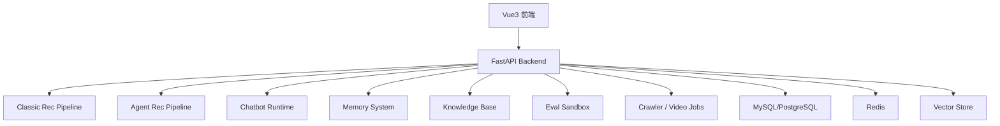

下面这版可以直接给 Cursor 作为最终重构说明。

**项目定位**
将旧项目 `integrated-rec-sys` 重构为：

```text
Movie Agent Lab：AI-native 电影 Agent 推荐实验平台
```

核心不是“电影推荐系统 + 聊天框”，而是一个以 **对话推荐、Agent Memory、知识库、传统推荐模型、Agent 推荐、评测沙箱** 为核心的实验平台。

**核心产品形态**
平台包含三条独立主线：

| 主线           | 说明                                           |
| ------------ | -------------------------------------------- |
| 传统推荐         | 支持热门推荐、相似电影、Embedding 推荐、NCF、Wide&Deep 等传统模型 |
| Agent 推荐     | 独立推荐路线，基于用户意图、Memory、知识库、工具调用生成推荐            |
| Chatbot 对话推荐 | 最重要的 AI-native 入口，用户通过自然语言表达观影需求             |

注意：**传统推荐和 Agent 推荐不是强耦合关系**。前端通过按钮切换：

```text
[传统推荐] [Agent 推荐]
```

它们调用不同接口，但返回统一推荐格式。

**总体技术栈**

```text
Frontend: Vue3 + Vite + TypeScript + Pinia
Backend: FastAPI + Pydantic + SQLAlchemy + Alembic
Database: 第一阶段复用旧 MySQL，长期可迁 PostgreSQL
Cache: Redis
Vector Store: 预留 pgvector / Qdrant / Milvus 抽象层
Agent: 预留 LangGraph / LlamaIndex 接口
Deploy: Docker Compose
```

**总体架构**



**数据层策略**
第一阶段不要破坏旧数据库。FastAPI 先通过 ORM 映射旧 MySQL 表，兼容读取和迁移。

| 数据类型                 | 第一阶段      | 长期建议                     |
| -------------------- | --------- | ------------------------ |
| 用户、电影、评分、收藏          | 复用旧 MySQL | 迁移到 PostgreSQL 或继续 MySQL |
| Redis embedding      | 继续用于传统推荐  | 保留为推荐缓存                  |
| 推荐日志、对话日志、Memory 元数据 | 新建表       | 独立 schema 或新数据库          |
| 知识库 embedding        | 新增向量库     | pgvector / Qdrant        |
| 视频截图 embedding       | 新增向量库     | 单独 collection            |
| 海报、截图、视频帧            | 本地目录起步    | MinIO / 对象存储             |

旧 Redis 里的 `USER_EMB`、`MOVIE_ITEM_EMB`、`MOVIE_DEEPWALK_EMB` 可以继续用于传统推荐，但不要把 Redis 当作未来唯一知识库。RAG、Agent Memory、视频帧检索应该进入独立 vector store。

**推荐目录结构**

```text
movie-agent-lab/
  backend/
    app/
      main.py
      core/
      api/v1/
      domains/
      recsys/
        contracts.py
        registry.py
        classic/
        agentic/
        metrics/
      chatbot/
      memory/
      knowledge/
      eval_sandbox/
      crawlers/
      video_understanding/
      models/
      schemas/
      repositories/
      services/
      workers/
    alembic/
    tests/
    pyproject.toml

  frontend/
    src/
      api/
      router/
      stores/
      types/
      pages/
        ChatRecommend/
        HomeRecommendation/
        MovieDetail/
        AgentMemory/
        KnowledgeBase/
        EvalSandbox/
        Admin/
      components/

  infra/
    docker-compose.yml
    postgres/
    redis/
    vector-db/

  docs/
    architecture.md
    api-design.md
    migration-plan.md
```

**后端模块说明**

| 模块                     | 职责                   |
| ---------------------- | -------------------- |
| `domains/`             | 用户、电影、评分、收藏等稳定业务领域   |
| `recsys/classic/`      | 传统推荐算法，不依赖 Agent     |
| `recsys/agentic/`      | Agent 推荐策略，独立于传统推荐   |
| `chatbot/`             | 对话推荐主流程              |
| `memory/`              | 用户画像、短期会话记忆、长期偏好记忆   |
| `knowledge/`           | 电影简介、评论、影人、剧情、问答的知识库 |
| `eval_sandbox/`        | 推荐算法和 Agent 推荐的离线评测  |
| `crawlers/`            | 新电影定期爬取入库，先预留        |
| `video_understanding/` | 高光视频截图、帧检索、多模态分析，先预留 |

**推荐接口设计**

```text
POST /api/v1/recommendations/classic
POST /api/v1/recommendations/agent
POST /api/v1/chat/sessions
POST /api/v1/chat/{session_id}/messages
GET  /api/v1/memory/profile/{user_id}
POST /api/v1/knowledge/search
POST /api/v1/eval/run
POST /api/v1/jobs/crawl-movies
POST /api/v1/jobs/analyze-video
```

统一推荐返回格式：

```json
{
  "mode": "agent",
  "trace_id": "rec_xxx",
  "items": [
    {
      "movie_id": 1,
      "title": "Toy Story",
      "score": 0.91,
      "reason": "匹配你最近偏好的轻松、幻想、适合晚间观看",
      "source": "agent"
    }
  ]
}
```

**前端设计重点**
`ChatRecommend` 是核心页面，不是普通小组件。建议三栏布局：

```text
左侧：用户 Memory、偏好标签、会话历史
中间：主对话窗口
右侧：推荐电影卡片、推荐理由、反馈按钮
```

首页 `HomeRecommendation` 保留推荐流，并提供模式切换：

```text
传统推荐 / Agent 推荐
```

页面优先级：

```text
1. ChatRecommend
2. HomeRecommendation
3. MovieDetail
4. AgentMemory
5. KnowledgeBase
6. EvalSandbox
7. Admin
```

**迁移步骤**

```text
Phase 1: 创建 FastAPI + Vue3 + Docker Compose 骨架
Phase 2: 连接旧 MySQL，映射 users/movies/ratings/collections
Phase 3: 实现电影列表、详情、评分、收藏、热门推荐
Phase 4: 迁移传统推荐逻辑，形成 classic pipeline
Phase 5: 实现 agent recommendation 的独立 mock pipeline

Phase 6: 实现 ChatRecommend 页面和对话 API mock
Phase 7: 新增 recommendation_runs、chat_messages、agent_memories 等 AI-native 表
Phase 8: 接入向量库抽象层，预留 knowledge/memory/video collections
Phase 9: 接入真实 RAG、Agent Memory、评测沙箱
```

**Cursor 执行要求**
重构时不要机械翻译旧 Spring Boot 代码。旧项目只作为业务逻辑和数据结构参考。新项目必须以 AI-native 平台为目标，优先保证模块边界清晰、数据层可迁移、推荐策略可插拔、对话推荐体验突出。

第一版可以不实现真实 Agent、RAG、爬虫和视频分析，但必须预留清晰目录、schema、接口和扩展点。所有公网 IP、模型地址、API key、图片路径都必须配置化，不能硬编码。
